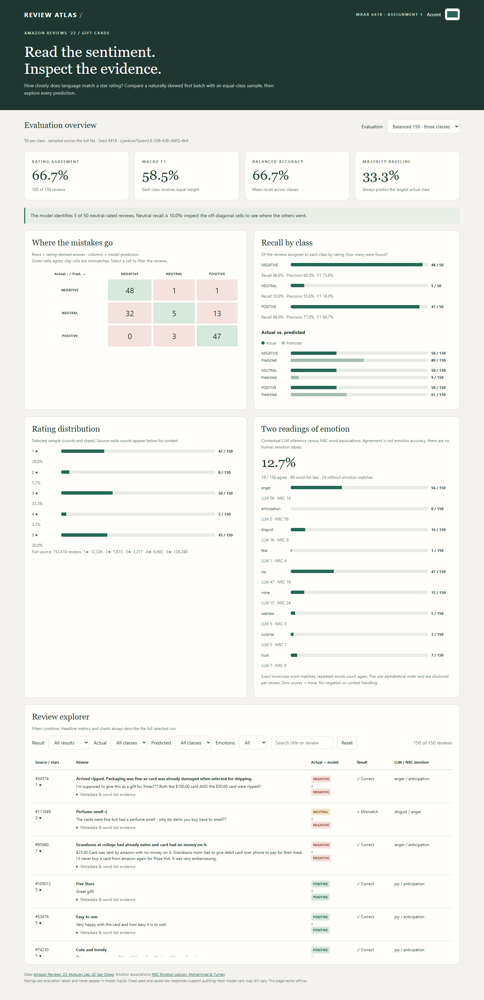
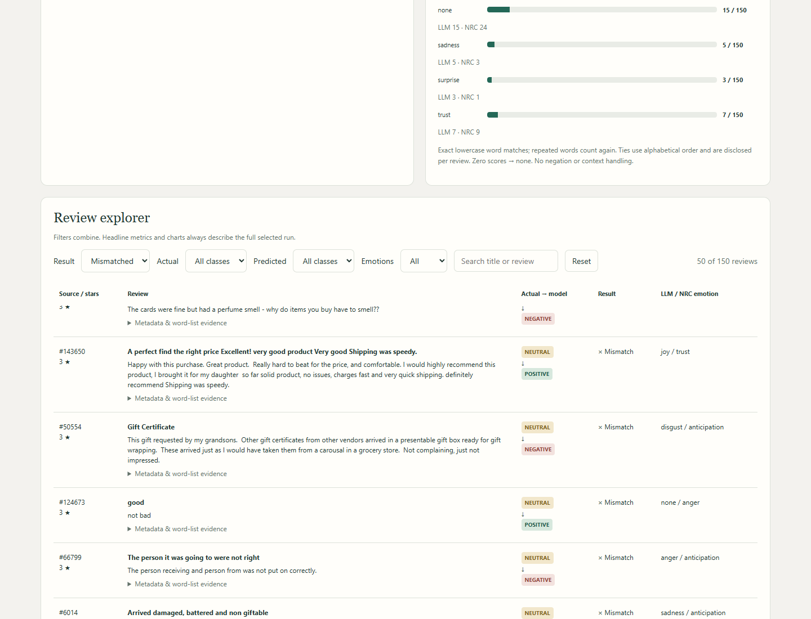

# Review Atlas: Amazon Gift Card Sentiment & Emotion

MBAX 6418 — Assignment 1. **Agent-generated report draft; student review and personal interpretation are still required before submission.**

## Main finding

The first-batch binary classifier agreed with ratings on **97/100 reviews (97.0%)**, but always predicting positive already achieved **93.0%**. On a balanced three-class sample, agreement was **100/150 (66.7%)**. The model recognized only **5/50 neutral-rated reviews (10.0% recall)**. High binary accuracy concealed a weak neutral category.



Open [dashboard.html](dashboard.html) after downloading the repository. It is self-contained and works offline. GitHub displays the HTML source rather than running it. Select either evaluation, filter reviews, click confusion-matrix cells, search review text, and adjust the accent color.

## Data and method

Data: [Amazon Reviews ’23](https://amazon-reviews-2023.github.io/), collected by the McAuley Lab at UC San Diego; [Gift Cards review download](https://mcauleylab.ucsd.edu/public_datasets/data/amazon_2023/raw/review_categories/Gift_Cards.jsonl.gz). The full gzip was parsed successfully before classifier construction. It contains **152,410** reviews: 134,940 positive, 3,271 neutral, and 14,199 negative under the three-class rating split. Source-wide star counts are visible in the dashboard and [dataset.json](results/dataset.json).

Model: `cyankiwi/Qwen3.6-35B-A3B-AWQ-4bit` through the course OpenAI-compatible endpoint. Temperature is zero, seed is 6418, thinking is disabled, output is constrained to an explicit JSON schema, and the output token limit is 512. Both final runs use those settings. Only title and body enter the user message: rating and other metadata are retained exclusively for evaluation. Titles such as “Five Stars” remain part of the original review language; the separate numeric rating field is never sent.

Binary labels are positive for ratings 4–5 and negative for 1–3. The first 100 file rows provide the imbalanced batch. The three-class labels are negative for 1–2, neutral for 3, and positive for 4–5. A single seeded reservoir-sampling pass across the entire file selects 50 per class, followed by a seeded shuffle. Sampling is without replacement by source line; duplicate review wording is not deduplicated. [samples.json](results/samples.json) freezes both selections. The model prompt is unchanged after seeing scored results except for enforcing the requested output format.

The prompt favors the substantive body over a conflicting title, recognizes terse praise and complaints, and uses dominant evaluation for mixed text. A genuinely balanced or factual review may be neutral in the three-class task. In the binary task, exactly balanced or factual text falls back to negative. Two synthetic positive/negative spot-checks passed; their output is saved in [spot.json](results/spot.json). They are not a performance estimate.

## Imbalance and what changed

| Metric | First 100, binary | Balanced 150, three classes |
|---|---:|---:|
| Rating agreement | 97.0% | 66.7% |
| Majority baseline | 93.0% | 33.3% |
| Macro F1 | 89.2% | 58.5% |
| Balanced accuracy (mean class recall) | 91.8% | 66.7% |

The binary batch contains 93 positive and 7 negative labels. The classifier found 6 of the negative reviews; negative precision is 75.0%, while positive recall is 97.8%. Overall accuracy alone would obscure the tiny negative denominator.

Binary confusion matrix:

| Actual / predicted | NEGATIVE | POSITIVE |
|---|---:|---:|
| NEGATIVE | 6 | 1 |
| POSITIVE | 2 | 91 |

Balanced three-class confusion matrix:

| Actual / predicted | NEGATIVE | NEUTRAL | POSITIVE |
|---|---:|---:|---:|
| NEGATIVE | 48 | 1 | 1 |
| NEUTRAL | 32 | 5 | 13 |
| POSITIVE | 0 | 3 | 47 |

The strongest direction of error is **neutral → negative (32)**, followed by **neutral → positive (13)**. Negative reviews are called neutral 1 time and positive 1 time; positive reviews are called neutral 3 times and negative 0 times. Negative and positive recall remain 96.0% and 94.0%. The model predicts neutral only 9 times.

This comparison changes the sample, label definition, and prompt together, so the accuracy difference is not a causal estimate of balancing alone. Three stars can accompany distinctly negative or positive wording. Under the assignment, those remain errors against the rating even when the text interpretation is plausible. No held-out prompt-tuning experiment or human sentiment relabeling was performed.

## LLM versus word-list emotions

The [NRC Emotion Lexicon](https://www.saifmohammad.com/WebPages/NRC-Emotion-Lexicon.htm), created by Saif Mohammad and Peter Turney at the National Research Council Canada, supplies the eight emotion associations. Reference: Mohammad & Turney (2013), *Crowdsourcing a Word–Emotion Association Lexicon*, Computational Intelligence 29(3), 436–465. Its educational/noncommercial terms apply. The lexicon itself is excluded from this repository; the downloader uses a [public mirror](https://github.com/dinbav/LeXmo) because the official ZIP returned HTTP 406. The exact download URL and SHA-256 are recorded in the balanced output.

The word-list script lowercases and HTML-unescapes title plus body, tokenizes English words, sums binary associations for every token occurrence, and selects the largest score. Ties choose the alphabetically first emotion; zero scores produce `none`. It keeps the full scores, tied leaders, and matched words for inspection. No stemming, negation handling, phrase understanding, or sarcasm detection is applied.

The methods agree on **19/150 (12.7%)**. NRC has **69 tied maxima** and **24 zero-match reviews**. NRC selects anticipation 76 times; the LLM selects it 0 times. This is method agreement, not emotion accuracy: the data has no human emotion ground truth.

For example, source line **34574** complains about ripped cards: the LLM selects **anger**, but NRC selects **anticipation**. Its only matched emotion word is “gift,” which scores anticipation, joy, and surprise equally; alphabetical tie-breaking determines the answer. This illustrates how topic words and tie policy can overwhelm the expressed emotion. Search “Arrived ripped” in the explorer and expand its evidence to inspect the scores.



## Issues and validation

- PowerShell failed to download the review file; Python's HTTPS downloader succeeded, and the entire gzip was parsed and checked for valid ratings and text.
- A prompt-only emotion response used a label outside the allowed vocabulary. An enforced JSON schema resolved it. The final balanced batch was rerun in full; malformed outputs are never scored as successes. The final binary batch was rerun with the same schema approach and retained the same matrix.
- The official NRC download returned HTTP 406. The mirrored file was validated for the expected word and association-row counts, and its checksum was saved.
- The first emotion chart omitted categories absent from LLM predictions. Using the union of both methods' categories revealed NRC anticipation; a missing count rendered as `undefined` and was corrected to zero.
- The bundled Playwright browser executable was absent. Browser checks used installed Microsoft Edge in headless mode. Nonzero bars are kept visible without inventing counts; zero bars stay zero. Labels live outside the bars.
- [verify.py](verify.py) recomputes metrics, checks source-line uniqueness and class balance, compares predictions with raw API responses, and checks NRC tie/no-match cases. Browser checks exercise exact filtered source rows, every matrix cell and filter count, empty search, emotion agreement filters, visible bar widths, and a narrow mobile layout. See [browser_checks.json](results/browser_checks.json). Screenshots were captured from the actual generated page.

## Reproduce

Python **3.11+** is required; runtime scripts use only the standard library. From this directory:

```powershell
# Set OPENAI_API_KEY locally to the course key. Never put it in committed files.
$env:OPENAI_BASE_URL = "http://dobolyi.com:9001/v1"
$env:OPENAI_MODEL = "cyankiwi/Qwen3.6-35B-A3B-AWQ-4bit"
python score_reviews.py prepare
python score_reviews.py spot
python score_reviews.py binary
python score_reviews.py balanced
python emotions.py
python verify.py
python dashboard.py
python report.py
```

The default `prepare` command downloads the dataset to ignored `data/`. Set `OPENAI_API_KEY` in the terminal environment before model calls. To reproduce the saved dashboard and report without model calls or downloads, run only `verify.py`, `dashboard.py`, and `report.py` against the included results. Fresh API calls may differ despite a seed and temperature zero; provider configuration and low-level inference can change. Cached responses are reused locally, and saved outputs—not a claim of guaranteed API determinism—are the audit record.

Optional browser validation and screenshot regeneration: install Node.js and Microsoft Edge, run `npm install`, then `npm run verify:browser`. The HTML itself requires neither. The browser checks use a local file URL and do not start a server.

## Working files and submission

- `prompts/`: reusable binary and three-class prompts.
- `score_reviews.py`: sampling, model calls, raw-response persistence and sentiment scoring.
- `emotions.py`: independent NRC emotion scoring.
- `dashboard.py` and `dashboard_template.html`: offline dashboard generator.
- `report.py`: generates this report from saved evidence.
- `results/binary.json`, `results/balanced.json`: saved review-level results, metrics and raw API responses.
- `results/samples.json`, `results/dataset.json`, `results/spot.json`: sampling provenance, full-source counts and spot-check evidence.
- `screenshots/`: desktop, explorer and mobile captures.

**Student action before submission:** check quoted numbers against the dashboard and saved output, revise the interpretation into your own words, and add your name. Publish this folder to your own GitHub repository and submit its shareable link in Canvas. This draft does not claim you have completed that review or submitted anything to Canvas. The large source dataset, lexicon, API keys, and local cache are excluded by `.gitignore`.

Dataset reference: Hou et al. (2024), *Bridging Language and Items for Retrieval and Recommendation*, [arXiv:2403.03952](https://arxiv.org/abs/2403.03952).
